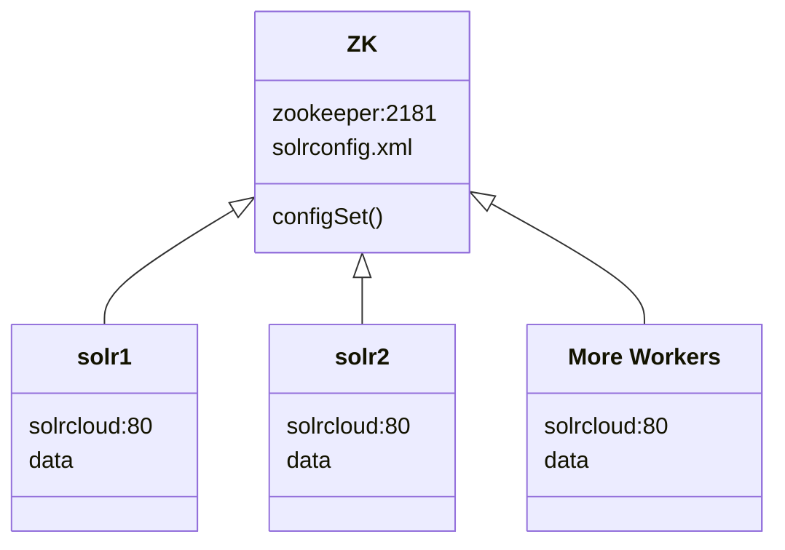

# Solr cloud

In folder `collection_backup` there are the backup of collection `omeka` made from `solrcloud`

In folder `omeka` there are the backup of solr core `omeka` made from `standalone`, and its data. 



### Collection commands
#### Create collection
```bash
curl "http://solr1:80/solr/admin/collections?action=CREATE&name=omeka&numShards=2&replicationFactor=2&maxShardsPerNode=2&collection.configName=omeka"
```
> **Note:** I tested relicationFactoer = Shards = 2, the number of shards and replication factor are the same. I am not aware/sure whether there will be side effects when they are different. What does this mean for HA?

#### Delete collection
```bash
curl "http://solr1:80/solr/admin/collections?action=DELETE&name=omeka"
```

#### Backup collection
```bash
curl "http://solr1:80/solr/omeka/replication?command=backup&location=/opt/solr/server/solr/collection_backup&name=omeka"
```
> **Note:** The backup folder is tricky to setup, permissions, sub-structure should be set correspondingly according to backup scheduling. 

#### Restore collection
```bash
curl "http://solr1:80/solr/omeka/replication?command=restore&location=/opt/solr/server/solr/collection_backup&name=omeka"
```
